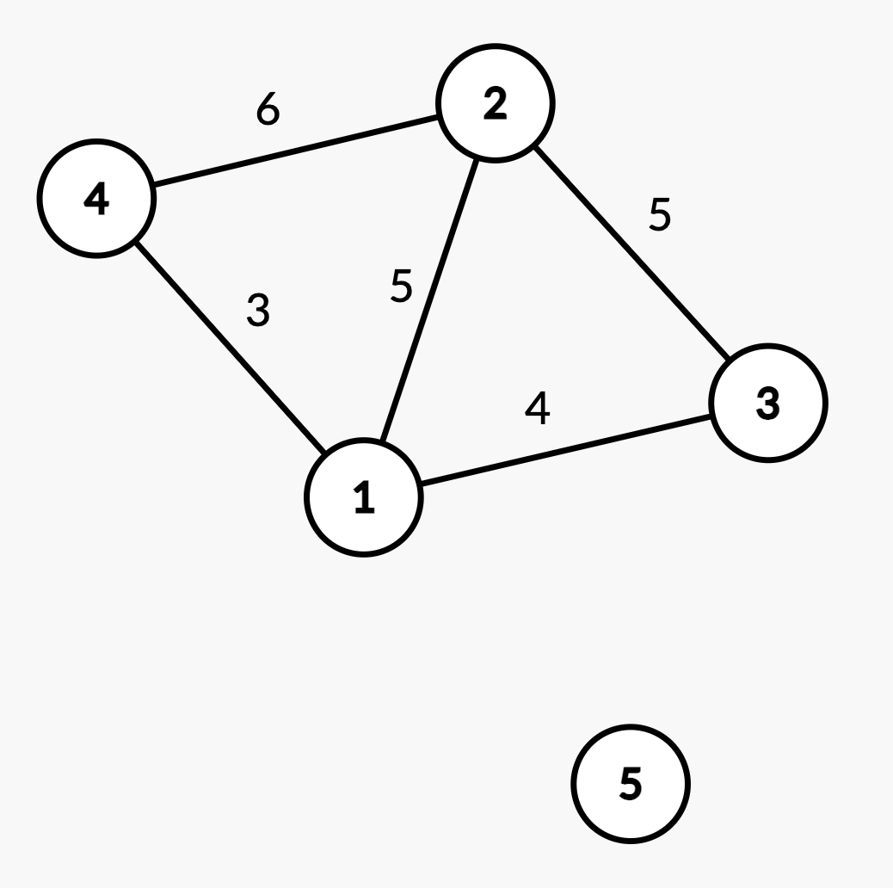
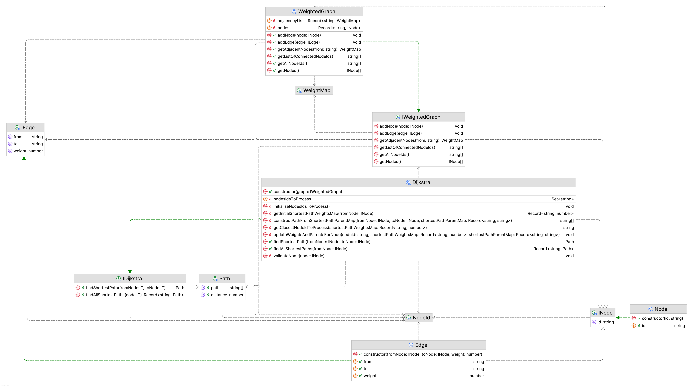

# 📚 Home Task: Dijkstra's Algorithm

The purpose of this task is to understand and implement the Dijkstra's algorithm for undirected weighted graph, a fundamental algorithm in Computer Science for finding the shortest paths in a graph. This will help you understand how to design and implement complex algorithms. The home task should be done using TypeScript.

## Requirements

You need to implement the following classes: `Node`, `Edge`, `WeightedGraph`, and `Dijkstra`. Here are their detailed requirements:

### Node

This class represents a node in the graph. Each node is identified by a unique id, which is a string. The `Node` class has a constructor that takes an id and assigns it to the `id` property of the `Node` instance.

### Edge

This class represents an edge in the graph. An edge is a connection between two nodes. The `Edge` class has a constructor that takes two `Node` instances and a weight. The `from` property represents the id of the node where the edge starts, the `to` property represents the id of the node where the edge ends, and the `weight` property represents the weight or cost of the edge.

### WeightedGraph

This class represents a weighted graph, which is a graph where each edge has a weight or cost. The `WeightedGraph` class has the following methods:

- `addNode(node: INode)`: This method adds a new node to the graph. It checks if a node with the same id already exists, and if so, throws an error with the message `Node with id {id} already exists`. If the node doesn't exist, it is added to the list of nodes in the graph and an entry for the node is created in the adjacency list with an empty `WeightMap` object. This signifies that the node doesn't have any adjacent nodes yet.
- `addEdge(edge: IEdge)`: This method adds a new edge to the graph. It checks if the nodes in the edge exist in the graph. If one of the nodes does not exist, it throws an error with the message `Invalid edge. One of the nodes does not exist`. If the nodes exist, the edge weight is added to the `WeightMap` objects of both nodes in the adjacency list, signifying that the nodes are adjacent and the edge weight is the cost to travel from one node to the other.
- `getAdjacentNodes(from: NodeId)`: This method returns a `WeightMap` object, which is a part of the adjacency list and represents the adjacent nodes and their corresponding edge weights for a given node. If the node doesn't have any adjacent nodes, this method returns an empty `WeightMap` object.
- `getListOfConnectedNodeIds()`: This method returns an array of node ids that are connected via edges. It does not throw any errors.
- `getAllNodeIds()`: This method returns an array of all node ids, regardless of whether they are connected or not. It does not throw any errors.
- `getNodes()`: This method returns an array of all `Node` instances in the graph. It does not throw any errors.

### Dijkstra

The class that implements Dijkstra's algorithm for finding the shortest paths in a graph with non-negative edge weights. This class takes a weighted graph as input. The class has the following methods:

- `findShortestPath(fromNode: INode, toNode: INode): Path`: This method finds the shortest path between `fromNode` and `toNode` using Dijkstra's algorithm. It returns an object of type `Path` that contains the shortest path as an array of node ids and the total distance of the path. If there is no path between `fromNode` and `toNode`, the method should return an object with an empty path array and a distance of `Infinity`. If `fromNode` or `toNode` (or both) do not exist in the graph, the method should throw an error for the first node with the message `Node with id {id} does not exist in the graph`, where `{id}` is the id of the non-existing node.
- `findAllShortestPaths(fromNode: INode): Record<NodeId, Path>`: This method finds the shortest paths from `fromNode` to all other nodes in the graph. It returns an object where the keys are the ids of the target nodes and the values are `Path` objects that contain the shortest path to the target node and the total distance of the path. If `fromNode` does not exist in the graph, the method should throw an error with the message `Node with id {id} does not exist in the graph`, where `{id}` is the id of the non-existing node.

## Example usage

For a graph bellow



the example usage might be the following

```typescript
const node1 = new Node('1');
const node2 = new Node('2');
const node3 = new Node('3');
const node4 = new Node('4');
const node5 = new Node('5');
const nodes = [
  node1,
  node2,
  node3,
  node4,
  node5,
];
const edges = [
  new Edge(node1, node4, 3),
  new Edge(node1, node2, 5),
  new Edge(node1, node3, 4),
  new Edge(node2, node4, 6),
  new Edge(node2, node3, 5),
];
const graph = new WeightedGraph();

nodes.forEach(node => graph.addNode(node));
edges.forEach(edge => graph.addEdge(edge));

const dijkstra = new Dijkstra(graph);

dijkstra.findShortestPath(node4, node3); // shortest path between different nodes exists { path: ['4', '1', '3'], distance: 7 }
dijkstra.findShortestPath(node1, node5); // shortest path between different nodes does not exist { path: [], distance: Infinity }
dijkstra.findShortestPath(node1, node1); // shortest path from node to itself { path: ['1'], distance: 0 }
dijkstra.findAllShortestPaths(node4);
/*
   {
     '1': { path: ['4', '1'], distance: 3 },
     '2': { path: ['4', '2'], distance: 6 },
     '3': { path: ['4', '1', '3'], distance: 7 },
     '5': { path: [], distance: Infinity }
   }
  */
```

## Class diagram

Here is how the class diagram of the final solution might look like. Note that in diagram `NodeId` is `type NodeId = string` and `WeightMap` is `type WeightMap = Record<NodeId, number>`. Also note, that private fields/methods that are not mentioned in this document but present in the diagram are implementation details of our solution that are not required for your implementation.



## Tips

Consider using tools like [CSAcademy Graph Editor](https://csacademy.com/app/graph_editor/) for visualizing weighted graphs. Such tools will help you better understand the relationships and connections between nodes. It's particularly useful when you're trying to reason about the shortest path between edges in a graph. Seeing this visually can be much more intuitive and efficient than interpreting lines of code, allowing you to identify patterns and anomalies more easily.
